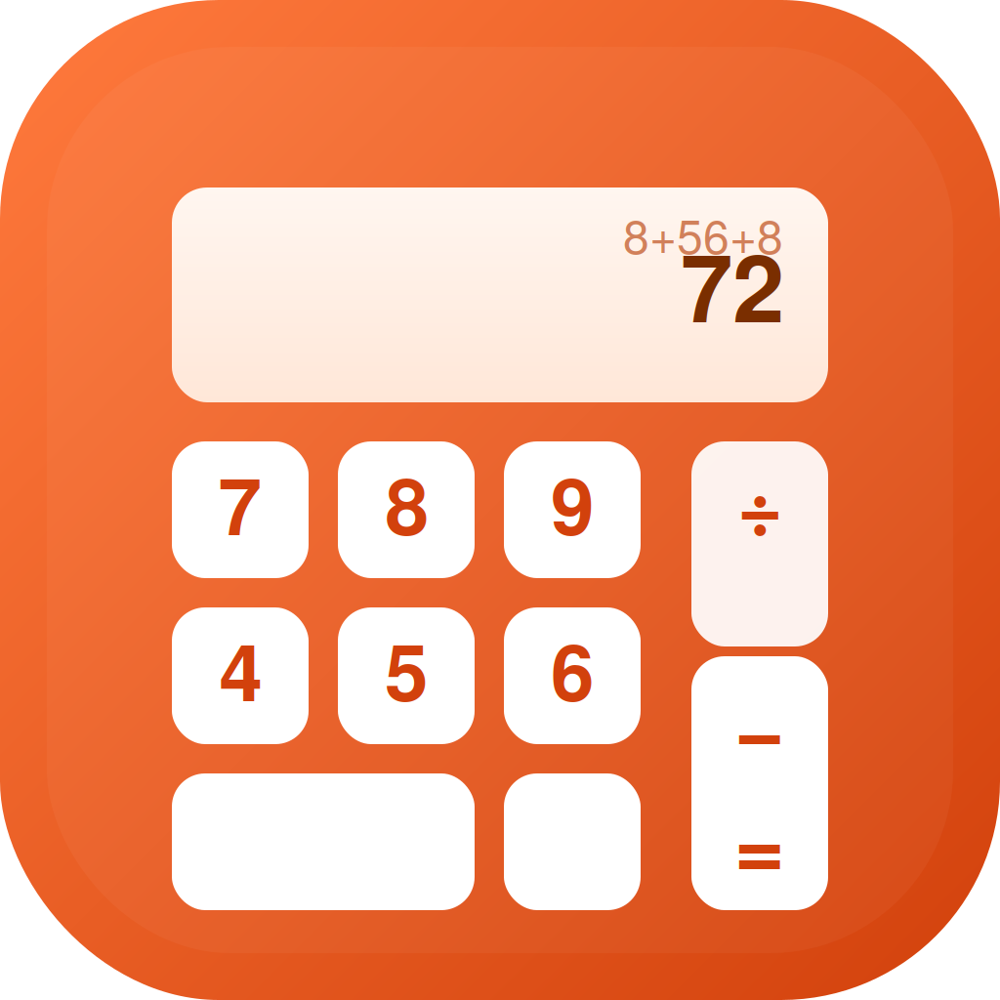
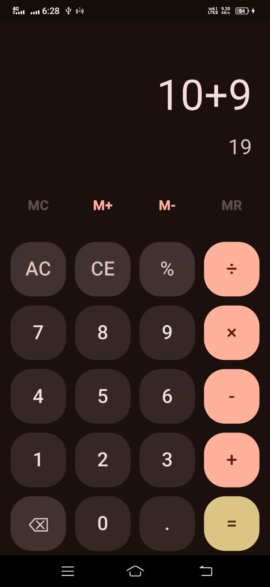
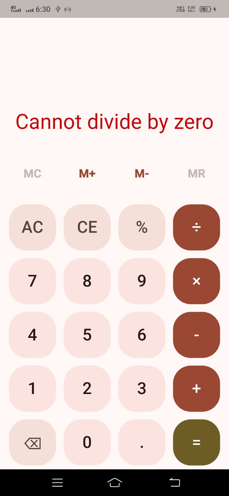
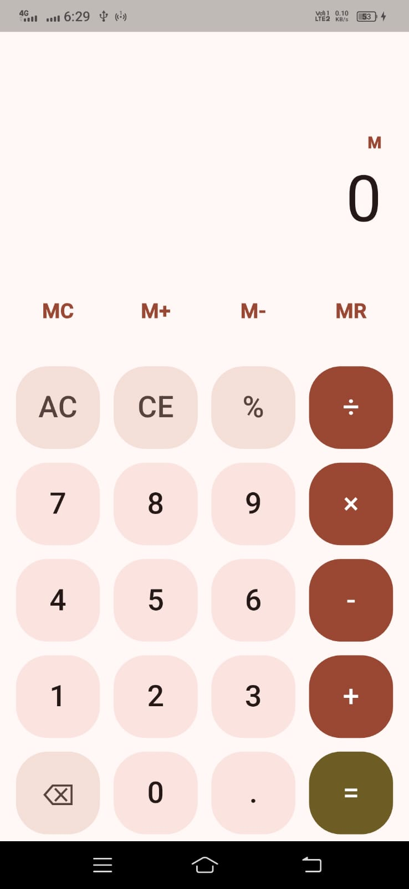

# 🧮 Calculator — Flutter + Cubit

A production-style calculator app built with Flutter, using the **Cubit** (BLoC family) state-management pattern. Built to demonstrate clean architecture, testable business logic, and attention to real UX details — not just "a calculator that adds two numbers."

<p align="center">
  
</p>

<p align="center">
  
  
  
  
  
</p>

> 📸 *Add your own screenshots/GIF here before publishing —see [Screenshots](#-screenshots) below for exactly what to capture.*

---

## ✨ Features

- **Arbitrary-length expressions** — `8+56+8`, not just "two numbers and an operator". Type as long an expression as you like.
- **Live-updating result** — the running total recalculates on every keystroke, before you even press `=` (matches how stock Android/iOS calculators behave).
- **Correct operator precedence** — `2+3×4` evaluates to `14`, not `20`. Multiplication/division resolve before addition/subtraction.
- **Memory functions** — `MC` / `M+` / `M-` / `MR`, with a small `M` indicator shown whenever memory holds a non-zero value. Memory survives `AC` (only `MC` clears it) — real calculator behaviour.
- **Safe error handling** — divide-by-zero shows a clear error state instead of crashing or displaying `Infinity`.
- **Floating-point cleanup** — `0.1 + 0.2` displays as `0.3`, not `0.30000000000000004`.
- **Expression chaining** — press `=` then an operator, and it continues from the previous result, just like a physical calculator.
- **Light & dark theme**, Material 3, haptic feedback on every button press.

---

## 🏗️ Architecture

This app is deliberately layered so that **each layer can be understood, changed, and tested in isolation**:

```
lib/
├── core/
│   └── calculator_engine.dart     # Pure math — zero Flutter imports, zero state
├── cubit/
│   ├── calculator_state.dart      # Immutable snapshot of what the UI shows
│   └── calculator_cubit.dart      # All business logic — the only place state changes
├── widgets/
│   └── calculator_button.dart     # Reusable, themeable button
├── screens/
│   └── calculator_screen.dart     # Composes Cubit + widgets into the UI
└── main.dart                      # Wires everything together, provides the Cubit
```

**Why Cubit over `setState`, Provider, or Riverpod?**
`setState` tangles UI and logic in one widget, making it untestable without pumping widgets. Cubit keeps every rule ("what happens when you press `+` twice in a row?", "how does `=` behave mid-chain?") in one testable class, completely decoupled from how any of it is drawn on screen. Provider/Riverpod solve a different problem (dependency injection across a large app); for a self-contained feature like this, Cubit gives the same testability with less ceremony.

**Key design decision — token-based expressions.** Rather than tracking "first number / operator / second number" (which breaks the moment you chain a third operation), the whole expression is stored as a flat list where **even indices are always numbers and odd indices are always operators** — e.g. `["8", "+", "56", "+", "8"]`. This one convention is what makes arbitrary-length expressions, live preview, and correct precedence all possible without special-casing.

---

## 🧪 Testing

Business logic is fully unit-testable **without a widget, an emulator, or a device** — that's the point of keeping it out of the widget tree:

```bash
flutter test
```

Covered: correct precedence, floating-point formatting, divide-by-zero handling, expression chaining, and memory operations. See `test/calculator_cubit_test.dart`.

---

## 🚀 Getting Started

```bash
git clone https://github.com/Faisal60177/calculator
cd calculator
flutter pub get
flutter run
```

**Requirements:** Flutter 3.x, Dart 3.x.

---

## 📸 Screenshots

Replace this section with real screenshots before sharing your portfolio/CV link. Capture at minimum:

| Light mode | Dark mode | Error state | Memory in use |
|---|---|---|---|
| ** | ** | ** | ** |

A quick way to generate clean device-frame screenshots: run the app on an emulator, then use `flutter screenshot` or your IDE's screenshot tool.

---

## 🗺️ Roadmap / Possible Extensions

These are intentionally **not** implemented, so they're good next steps to extend the project further:

- [ ] Persist memory value across app restarts (`shared_preferences`)
- [ ] Calculation history list
- [ ] Scientific mode (sin/cos/log/parentheses)
- [ ] Accessibility: `Semantics` labels on every button for screen readers
- [ ] Golden tests for the display widget

---

## 👤 Author

**Mohammad Faisal**
Computer Science Student · Flutter Mobile App Developer
🔗 [GitHub](https://github.com/Faisal60177) · [LinkedIn](www.linkedin.com/in/mohammad-faisal-7b65ab3b6) · [Portfolio](https://mohammad-faisal.vercel.app/)

---

## 📄 License

This project is licensed under the MIT License — see [LICENSE](LICENSE) for details.